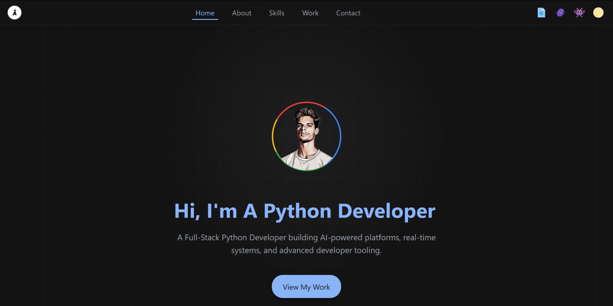
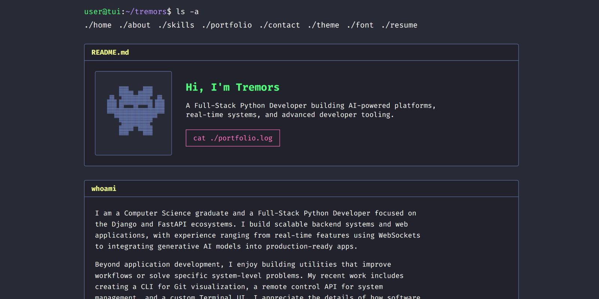

# 🌐 Project Overview

This repository hosts my **personal portfolio**, built in two distinct versions:

- 🌇 **[`index.html`](https://qtremors.github.io/)** – Modern, Material Design-inspired UI with animations, dynamic JSON content loading, and a modular Theme & Effects engine.
    
- 📄 **`project.html`** – A dedicated, dynamic detail view for every project, featuring deep linking, interactive terminal widgets, and tech specs.
    
- 👾 **[`tui.html`](https://qtremors.github.io/tui.html)** – Terminal-inspired TUI with multiple themes, fonts, and a CSS-only splash screen.
    

All versions are **fully responsive**, minimalist, and built with **clean, semantic HTML and CSS**.

The TUI version is completely **JavaScript-free**, utilizing advanced CSS selectors for interactivity, while the modern version uses **modular vanilla JS** for data fetching and theme logic.

---

## 📸 Screenshots

### 🌇 Modern UI [▶](https://qtremors.github.io/) 

### 👾 Terminal TUI [▶](https://qtremors.github.io/tui.html)

---

## ✨ Key Features

### 🌇 Modern UI (`index.html` & `project.html`)

This version focuses on a scalable, data-driven user experience with a professional aesthetic.

#### **Architecture & Data**

- **Dynamic Content Loading:** Projects are fetched dynamically from **`projects.json`** using the Fetch API with a "Load More" logic and state persistence.
    
- **Decoupled JavaScript:** Logic is split into context-aware files (`home.js`, `project.js`, `extras.js`) to ensure only necessary code loads per page.
    
- **Modular CSS Architecture:** Styles are split into distinct files (`base`, `sections`, `animations`) linked directly to avoid `@import` performance bottlenecks.
    
- **Project Detail Views:**
    - **Deep Linking:** URLs like `project.html?id=quizzer-ai` dynamically render content.
    - **Smart Terminal Widget:** Interactive installation guide with **OS detection** (Windows/Mac/Linux), syntax highlighting, and window controls.
    - **Rich Data:** Supports "Tech Spec" feature lists and long-form descriptions.

#### **UI & Visual Design**

- **Advanced Theme & Effects Engine:**
    - **Settings Modal:** A centralized UI to toggle Themes (MD/MD3/OLED), Visual Effects (Fog/Glass/None), and Spotlight logic.
    - **OLED Default:** Clean, distraction-free OLED theme loads by default with no effects enabled.
    - **Universal Fog/Glass:** Optional context-aware backgrounds that either blend sections seamlessly (Fog) or provide high-tech frosted glass borders (Glass).
    - **Mouse Spotlights:** Radial gradients that track mouse movement on the Hero and Skill cards.
    - **Magnetic Text:** Physics-based hover effects on text elements.

- **Material Design 3 (MD3) Support:** Includes a dedicated **MD3 Theme engine** that reshapes buttons and morphs UI elements with smooth SVG animations.
    
- **Dynamic Theming:** **JavaScript-powered light/dark mode toggle** with `localStorage` persistence and no flash of unstyled content (FOUC).
        
- **Immersive Navigation:** Navigation bars **auto-hide on scroll** (debounced) and feature active section highlighting using an enhanced `IntersectionObserver`.

#### **⏱️ Time Machine (History)**
- **Visual Timeline:** A dedicated page (`system/history.html`) visualizing the project's evolution from v0.0.0 to v2.1.0.
- **Gource Visualization:** Embedded 60fps timelapse video showing the codebase growth and file restructuring over time.
    

---

### 👾 Terminal UI (`tui.html`)

This version is a **creative exploration of what's possible with only HTML and CSS**, prioritizing performance and a unique retro aesthetic.

#### **UI & Visual Design**

- **Retro TUI Aesthetic:** Classic command-line look with monospaced fonts and prompt-style navigation.
    
- **Expanded Themes:**
    - **Dracula** (Default)
    - **Catppuccin** (Macchiato)
    - **Tokyo Night**
    - *Themes are switched using hidden radio inputs and CSS sibling combinators.*

#### **UX & Interactivity**

- **Git Log History:** A terminal-styled history page (`system/history-tui.html`) featuring an ASCII git graph and command-line aesthetics.

- **CSS-Only "Show More":** Uses the **`:target` CSS pseudo-class** to reveal hidden projects without JavaScript.
    
- **Boot Sequence:** Animated splash screen simulating a **terminal boot-up** using CSS keyframes.
    
- **Accessibility:** Uses `clip-path` instead of `display:none` to ensure content remains accessible to screen readers while visually hidden.

---

## 🚧 Development Status Features

The system includes specialized handling for projects that are currently being built or are temporarily offline:

- **Visual WIP Indicators:** Projects marked as `wip` in the JSON data are automatically rendered with a **"Hazard" theme**—featuring a yellow border and a holographic "Construction Zone" stripe overlay.

- **Beta Status Styling:** Projects marked as `beta` display a **cyan/purple gradient** with a pulsing badge and futuristic hover effects.
    
- **Custom 404 & System Pages:**
    - **Modern UI:** Redirects to `system/index-404.html`, featuring an interactive toggle between "Cat" and "Coding" animations.
    - **TUI:** Redirects to `system/tui-404.html`, a text-only error page with CRT glitch effects.
    - **Root 404:** A theme-aware `404.html` that matches the site's aesthetic for GitHub Pages default error handling.

---

## 🔧 Technologies Used

|**Technology**|**Usage**|
|---|---|
|**HTML5**|Structure & semantics|
|**CSS3**|Modular architecture, Themes, Effects (Fog/Glass), Animations|
|**JavaScript**|ES6 Modules, Fetch API, IntersectionObserver, LocalStorage|
|**JSON**|Data storage for Portfolio projects|
|**FFmpeg / Gource**|Version control visualization and video optimization|

---

## 📈 Evolution of the Project

This portfolio has evolved from a simple static page to a complex engineering project. You can explore the full timeline in the **Time Machine** (accessible via the alien icon 👽 menu).

### 📽️ Watch the Evolution
## 📺 [History - v0.0.0-v2.0.0](https://qtremors.github.io/system/history.html)

* **v2.5.0 (The Deep Review):** Added GitMig, RepoTree, Earnslate (live), Cosmos projects. Major codebase review with 10+ bug fixes, waves pattern rewrite, DEVELOPMENT.md guidelines, and project reordering.
* **v2.3.0 (Accessibility & DX):** Added terminal auto-detect reset, JSON error handling, dynamic canonical tags, ARIA labels, and description clamping.
* **v2.2.3 (Accessibility & SEO):** Added skip-to-content link, reduced motion support, Twitter Card meta tags, sitemap.xml, robots.txt, and theme-aware 404.html. Added Tremors Music App (Desktop) and Arcade Nexus projects.
* **v2.2.0 (The Theme & Effects Engine):** Introduced a modular theme system with independent effects (Fog, Glass, Spotlight) and a centralized Settings Modal.
* **v2.1.0 (The Time Machine):** Introduced the `system/` directory structure, visual history timelines, and embedded Gource visualization.
* **v2.0.0 (The Architecture Era):** A complete rewrite of the core logic. Introduced a decoupled JavaScript architecture, a "Smart Terminal" widget, and a context-aware Fog system.
* **v1.5.0 - v1.9.0 (The Feature Surge):** Transitioned to **Material Design 3 (MD3)** with a dedicated theme engine. Added "Load More" dynamic pagination and the first iteration of the TUI.
* **v1.0.0 - v1.4.0 (The Visual Identity):** Moved away from generic styles to a distinct **Material Design** aesthetic. Introduced tech badges and proficiency bars.
* **v0.0.0 (The Beginning):** Initial release as a lightweight, static HTML/CSS personal website.

---

**Crafted with ❤️ by Tremors**