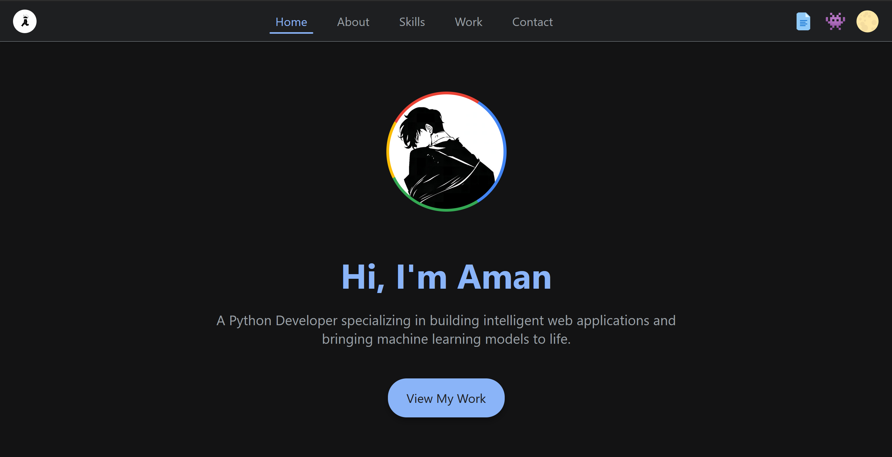
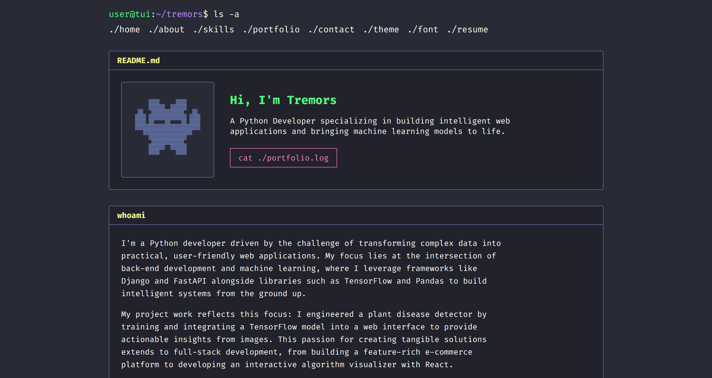

# 🌐 Project Overview

This repository hosts my **personal portfolio**, built in two distinct versions:

- 🌇 **[`index.html`](https://qtremors.github.io/tremors)** – Modern, Material Design-inspired UI with animations, dark mode toggle, and interactive elements.
- 👨‍💻 **[`indextui.html`](https://qtremors.github.io/tremors/indextui.html)** – Terminal-inspired TUI with multiple themes, fonts, and a CSS-only splash screen.

Both versions are **fully responsive**, minimalist, and built with **clean, semantic HTML and CSS**.  
The TUI version is completely **JavaScript-free**, while the modern version uses **vanilla JS** to enhance user experience.

---

## 📸 Screenshots

### 🌇 Material UI [▶](https://qtremors.github.io/tremors) 

### 👾 Terminal TUI [▶](https://qtremors.github.io/tremors/indextui.html)

---

## ✨ Key Features

### 🌇 Modern UI (`index.html`)

This version focuses on a clean, modern user experience with smooth interactions and a professional aesthetic.

#### **UI & Visual Design**
- **Layout:** Material Design-inspired, card-based layout that is spacious and clean.
- **Responsiveness:** Fully responsive design with:
  - **Mobile:** Bottom navigation bar.
  - **Desktop:** Top app bar.
- **Dynamic Theming:** A **JavaScript-powered light/dark mode toggle**.  
  The user's choice is stored in `localStorage` for a **persistent experience**.

#### **UX & Interactivity**
- **Immersive Navigation:**  
  - Navigation bars **auto-hide on scroll down** and **reappear on scroll up**.  
    Implemented with a **debounced scroll listener** in vanilla JS for performance.
- **Active Section Highlighting:**  
  - Uses the **IntersectionObserver API** to efficiently detect the current section in view and update active states.
- **Rich Micro-interactions:**  
  - **Animated Skill Badges:** Subtle CSS-animated underline on hover.
  - **Gradient Hover Effects:** Profile picture and header icons have **rotating conic-gradient borders** on hover.

---

### 👨‍💻 Terminal UI (`indextui.html`)

This version is a **creative exploration of what's possible with only HTML and CSS**, prioritizing performance and a unique retro aesthetic.

#### **UI & Visual Design**
- **Retro TUI Aesthetic:**  
  - Classic command-line look with monospaced fonts, panel-based layout, and prompt-style navigation.
- **JS-Free Customization:**  
  - **Themes:** Dracula & Catppuccin  
  - **Fonts:** Fira Code & Roboto Mono  
  Achieved using **hidden radio inputs** and the **CSS general sibling combinator (`~`)** (the "checkbox hack").

#### **UX & Interactivity**
- **CSS-Only Animations:**  
  - Retro ASCII art logo on an animated splash screen simulating a **terminal boot-up sequence**.
- **JavaScript-Free Interactivity:**  
  - All interactive elements (e.g., dropdowns using `
`) built without JS.
- **Uncompromising Performance:**  
  - Zero JavaScript = **lightning-fast loading** and **maximum reliability**.

---

## 🚧 Development Status
This project is a **work in progress**.  
Some project links under **"Work" / "Portfolio"** may currently lead to an **"Under Construction"** page.  
This is intentional while I continue building and deploying live demos.

---

## 🔧 Technologies Used

| Technology   | Usage                                                                 |
|-------------|------------------------------------------------------------------------|
| **HTML5**   | Structure & semantics                                                 |
| **CSS3**    | Layouts, animations, variables, responsive design, JS-free interactivity |
| **JavaScript** | Only in `index.html` for theme toggle, scroll detection & active links |

---

## 📃 HTML Files
- `index.html` – 🌇 Modern UI version (with JavaScript)
- `indextui.html` – 👨‍💻 Terminal TUI version (no JavaScript)
- **`construction.html` & `constructiontui.html`** – Placeholder pages for projects under development.

---

**Crafted with ❤️ by Tremors**
