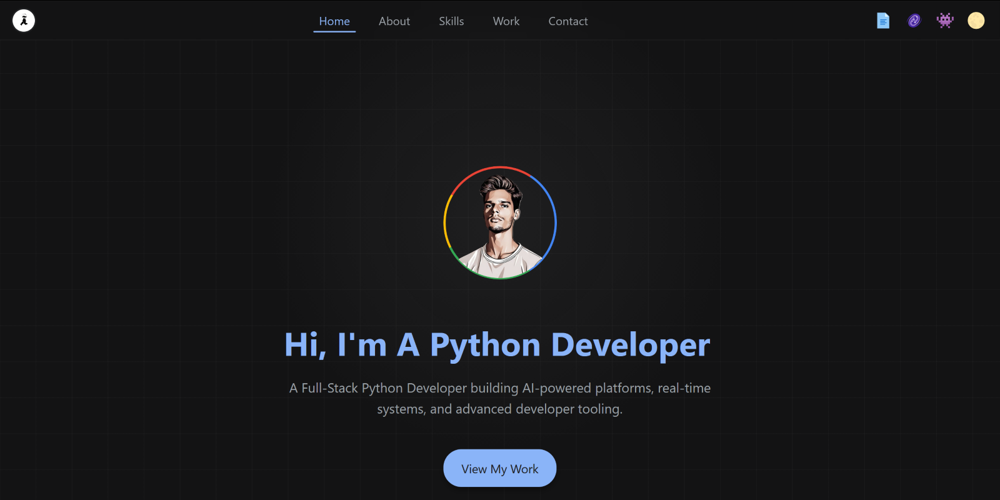
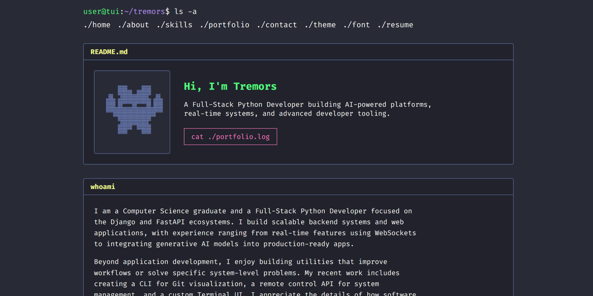

<p align="center">
  
</p>

<h1 align="center"><a href="https://qtremors.github.io">Tremors Portfolio</a></h1>

<p align="center">
  A dual-mode personal portfolio with Material Design aesthetics, Terminal TUI, and zero JavaScript dependencies in TUI mode.
</p>

<p align="center">
  
  
  
  
</p>

> [!NOTE]
> **Personal Portfolio** 🎯 This is my personal portfolio website featuring both Modern UI and Terminal TUI experiences.

## Live Website

**➡️ [https://qtremors.github.io](https://qtremors.github.io)**

---

## ✨ Features

| Feature | Description |
|---------|-------------|
| 🌇 **Modern UI** | Material Design-inspired interface with dynamic JSON loading, theme engine, and visual effects. |
| 👾 **Terminal TUI** | Retro command-line aesthetic with zero JavaScript—pure HTML/CSS interactivity. |
| 📄 **Project Details** | Deep linking, OS-aware terminal widgets, and rich tech specs for each project. |
| 🎨 **Theme Engine** | MD/MD3/OLED themes with Fog/Glass effects and mouse-tracking spotlights. |
| ⏱️ **Time Machine** | Visual timeline and Gource visualization of the project's evolution. |
| 🚧 **Status Indicators** | WIP/Beta/Archive badges with distinct visual treatments. |

---

## 📸 Screenshots

### 🌇 Modern UI [▶](https://qtremors.github.io/) 


### 👾 Terminal TUI [▶](https://qtremors.github.io/tui.html)


---

## 🛠️ Tech Stack

| Layer | Technology |
|-------|------------|
| **Structure** | HTML5, Semantic markup |
| **Styling** | CSS3, Modular architecture, Themes, Effects (Fog/Glass), Animations |
| **Logic** | ES6 Modules, Fetch API, IntersectionObserver, LocalStorage |
| **Data** | JSON (Portfolio projects) |
| **Visualization** | FFmpeg, Gource (Version control timelapse) |

---

## 📁 Project Structure

```
qtremors.github.io/
├── index.html                # Modern UI landing page
├── project.html              # Dynamic project detail view
├── tui.html                  # Terminal TUI (JS-free)
├── 404.html                  # Theme-aware error page
├── assets/                   # Images & screenshots
├── data/                     # projects.json
├── static/                   # CSS & JS modules
│   ├── css/                  # Modular stylesheets
│   └── js/                   # ES6 modules
├── system/                   # History & 404 pages
├── CHANGELOG.md              # Version history
├── DEVELOPMENT.md            # Developer documentation
├── LICENSE.md                # License terms (TSL)
└── README.md
```

---

## 🌇 Modern UI Features

### Architecture & Data
- **Dynamic Content Loading:** Projects fetched from `projects.json` with "Load More" pagination
- **Decoupled JavaScript:** Context-aware modules (`home.js`, `project.js`, `extras.js`)
- **Modular CSS:** Split into `base`, `sections`, `animations` for performance

### Project Detail Pages
- **Deep Linking:** URLs like `project.html?id=quizzer-ai` render dynamic content
- **Smart Terminal Widget:** OS detection (Windows/Mac/Linux), syntax highlighting
- **Rich Tech Specs:** Feature lists and long-form descriptions

### Visual Design
- **Theme Engine:** MD/MD3/OLED themes with Settings Modal
- **Effects:** Fog, Glass, Mouse Spotlights, Magnetic Text
- **Auto-Hide Navigation:** Debounced scroll with `IntersectionObserver`

---

## 👾 Terminal TUI Features

### Zero JavaScript
- Pure HTML/CSS interactivity using radio inputs and CSS sibling combinators
- `:target` pseudo-class for "Show More" functionality
- CSS keyframe boot sequence animation

### Themes
| Theme | Style |
|-------|-------|
| **Dracula** | Default |
| **Catppuccin** | Macchiato variant |
| **Tokyo Night** | Dark purple aesthetic |

### Accessibility
- `clip-path` for screen reader support (vs `display:none`)
- Git Log History page with ASCII git graph

---

## 🚧 Development Status Features

| Status | Visual Treatment |
|--------|------------------|
| **WIP** | Yellow border with holographic "Construction Zone" stripes |
| **Beta** | Cyan/purple gradient with pulsing badge |
| **Archive** | Distinct archive styling |

### Custom 404 Pages
- **Modern UI:** `system/index-404.html` with Cat/Coding animation toggle
- **TUI:** `system/tui-404.html` with CRT glitch effects
- **Root:** Theme-aware `404.html` for GitHub Pages

---

## 📈 Evolution

This portfolio has evolved from a static page to a complex engineering project. Explore the full timeline via the **Time Machine** (👾 alien icon menu).

### 📺 [Watch the Evolution → History v0.0.0-v3.0.0](https://qtremors.github.io/system/history.html)

| Version | Highlights |
|---------|------------|
| **v3.0.0** | Hero waves redesign, XSS-safe DOM rendering, full content rewrite for all 20 projects, badge audit, cross-file sync |
| **v2.9.x** | Added Localghost, Xcrape, Diff Viewer; full codebase audit; dependency guards |
| **v2.8.x** | HTML deduplication via `components.js`, namespace safety, DEVELOPMENT.md rewrite, dynamic OG tags, Scroll Spy |
| **v2.7.0** | README reformat, DEVELOPMENT.md technical reference |
| **v2.6.5** | Theme initialization fixes, unified settings modal, Glass effect light mode fix |
| **v2.6.0** | Project Status banners, Recommended Projects engine, improved mobile UX |
| **v2.5.0** | Deep codebase review, waves pattern rewrite, DEVELOPMENT.md |
| **v2.2.0** | Theme & Effects Engine with Settings Modal |
| **v2.1.0** | Time Machine with visual history timelines |
| **v2.0.0** | Architecture rewrite, Smart Terminal widget |
| **v1.5.0** | Material Design 3 (MD3) theme engine |
| **v1.0.0** | Material Design aesthetic, tech badges |
| **v0.0.0** | Initial static HTML/CSS release |

---

## 📚 Documentation

| Document | Description |
|----------|-------------|
| [DEVELOPMENT.md](DEVELOPMENT.md) | Architecture, naming conventions, and technical reference |
| [CHANGELOG.md](CHANGELOG.md) | Version history and release notes |
| [TASKS.md](TASKS.md) | Planned features and known issues |
| [LICENSE.md](LICENSE.md) | License terms and attribution |

---

## 📄 License

**Tremors Source License (TSL)** — Source-available license allowing viewing, forking, and derivative works with **mandatory attribution**. Commercial use requires written permission.

Web Version: [github.com/qtremors/license](https://github.com/qtremors/license)

See [LICENSE.md](LICENSE.md) for full terms.

---

<p align="center">
  Made with ❤️ by <a href="https://github.com/qtremors">Tremors</a>
</p>